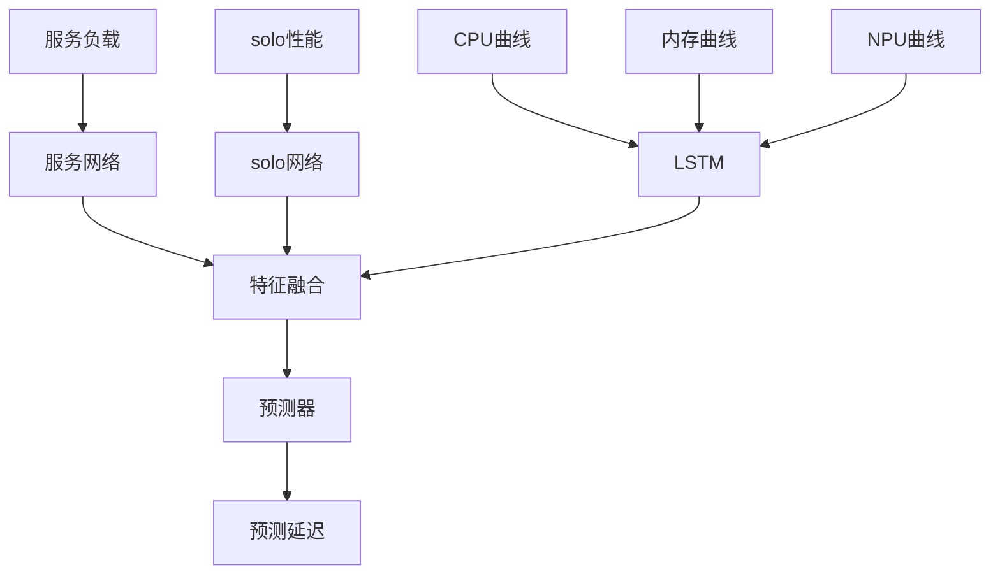

# 前言
任务类型: YoloV5、Bert、ResNet
服务类型： YoloV5、Bert、ResNet
设备类型：ATLAS、RK3588
资源类型： cpu、mem、npu

# 任务延迟的影响因素
常量信息：任务对资源的敏感度、任务单独运行时的性能
变量信息：节点上各个服务负载的资源占用比例
## 模型设计
希望可以提取变量信息的负载特征提取，之后使用借鉴敞亮信息 预测出整体性能

## 备注
# 数据结构定义
CONSTANT_INFO = {
    "YoloV5": {
        "ATLAS": {
            "sensitivity": {
                "cpu": {"pressure": [0.1, 0.3, 0.6, 0.9], "delay": [13, 20, 43, 80]},
                "mem": {"pressure": [0.1, 0.3, 0.5], "delay": [10, 18, 35]},
                "npu": {"pressure": [0.2, 0.5, 0.8], "delay": [20, 45, 100]}
            },
            "solo_performance": {"delay": 12.0}
        }
    },
    "Bert": {
        "ATLAS": {
            "sensitivity": {
                "cpu": {"pressure": [0.1, 0.3, 0.6, 0.9], "delay": [15, 22, 45, 85]},
                "mem": {"pressure": [0.1, 0.3, 0.5], "delay": [12, 20, 38]},
                "npu": {"pressure": [0.2, 0.5, 0.8], "delay": [22, 48, 105]}
            },
            "solo_performance": {"delay": 14.0}
        }
    }
}

VARIABLE_INFO = {
    "nodes": {
        "node1": {
            "node_id": "node1",
            "dev_type": "ATLAS",
            "service": {
                "YoloV5": {"cpu": 0.2, "mem": 0.3, "npu": 0.5},
                "Bert": {"cpu": 0.2, "mem": 0.3, "npu": 0.5}
            }
        }
    }
}