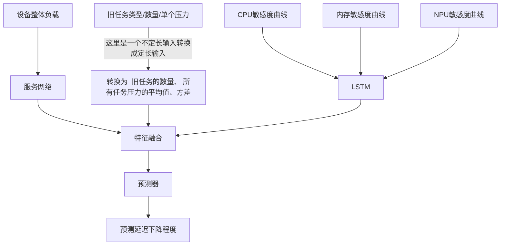

```mermaid
graph TD
    A[设备整体负载] --> B[服务网络]
    C[旧任务类型/数量/单个压力] -->|这里是一个不定长输入转换成定长输入| O[转换为  旧任务的数量、 所有任务压力的平均值、方差]
    E[CPU敏感度曲线] --> F[LSTM]
    G[内存敏感度曲线] --> F
    H[NPU敏感度曲线] --> F
    B --> I[特征融合]
    O-->I
    F --> I 
    I --> J[预测器]
    J --> K[预测延迟下降程度]
```